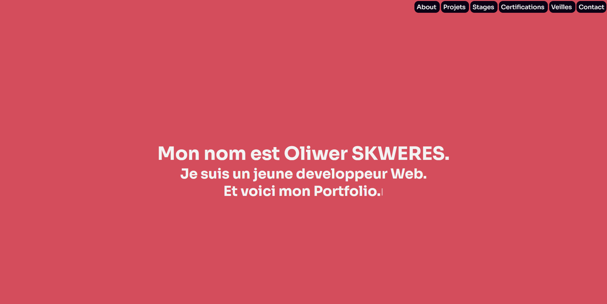
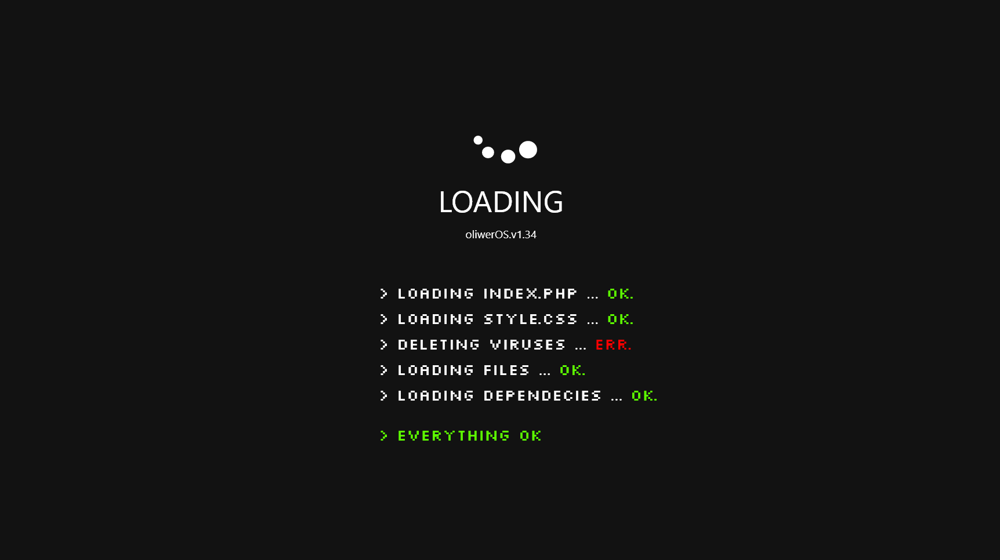
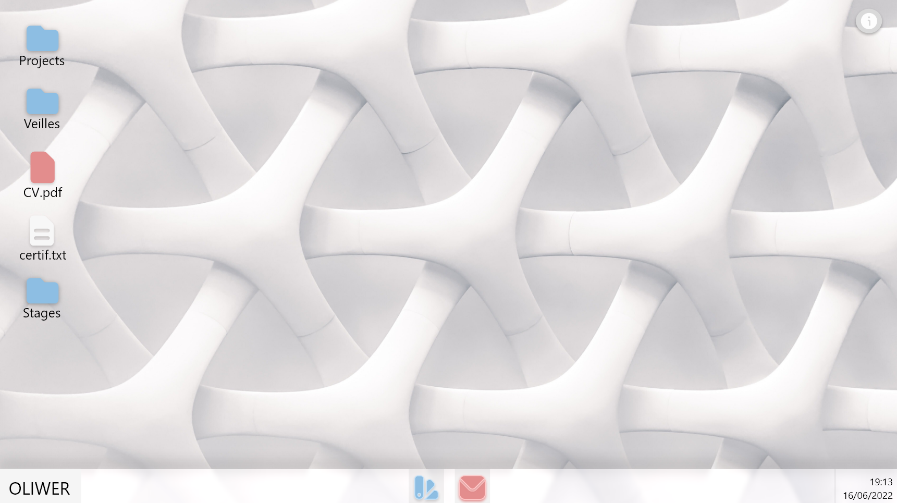
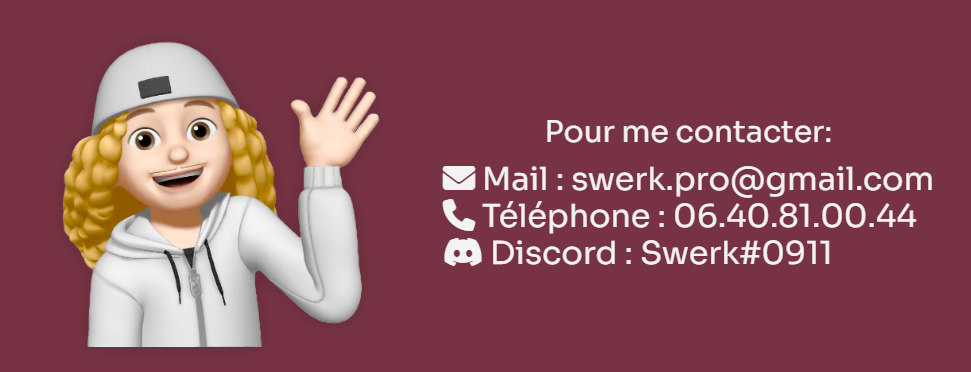

# Portfolio 

Bienvenue sur le Readme de mon Portfolio.

## Introduction

Pour le début d'année scolaire 2022-2023, j'ai décidé de coder un portfolio. Anciennement héberger sur [Nexgate](https://www.nexgate.ch), je trouvais que utiliser Wordpress pour le site n'était pas vraiment représentatif.
J'ai décidé donc de coder le site en partant de 0, en utilisant seulement du HTML, CSS et Javascript sans utiliser de Frameworks.

## Auteurs
L'auteur du site est [Swerk](https://github.com/SwerkF), developpeur de 20 ans en BTS SIO.

## Fonctionnalités

Le site est disponible avec 2 URLS: [www.skweres.xyz](https://www.skweres.xyz) OU [www.swerk.dev](https://www.swerk.dev)

Pour le moment, le site ne propose pas grand chose, cependant, une version mobile est en cours de developpement ainsi qu'une thème sombre.

L'objectif final, est que le Portfolio évolue afin de proposer un système d'éxploiatation en ligne en guise de Portfolio.
Les maquettes du site sont disponible juste en dessous : 

## Technologies
Les technologies utilisées sur le site sont : 
- [HTML](https://developer.mozilla.org/fr/docs/Web/HTML)
- [CSS](https://developer.mozilla.org/fr/docs/Web/CSS)
- [JS](https://developer.mozilla.org/fr/docs/Web/JavaScript)

Pour les librairies JavaScript, j'ai utilisé : 
- [AOS](https://github.com/michalsnik/aos)
- [Typed.JS](https://github.com/mattboldt/typed.js)

Pour générer les couleurs, j'ai utilisé le site [Coolors.co](https://coolors.co), en utilisant les couleurs :
- `#D44D5C`
- `#F5E9E2`
- `#F3F3F3`
- `#0B0014`

Au final, pour générer les vagues pour les transitions, j'ai utilisé le site [Getwaves.io](https://getwaves.io).

L'hébergement du site se fait via [GitHub Pages](https://pages.github.com/).

## Contacts 

